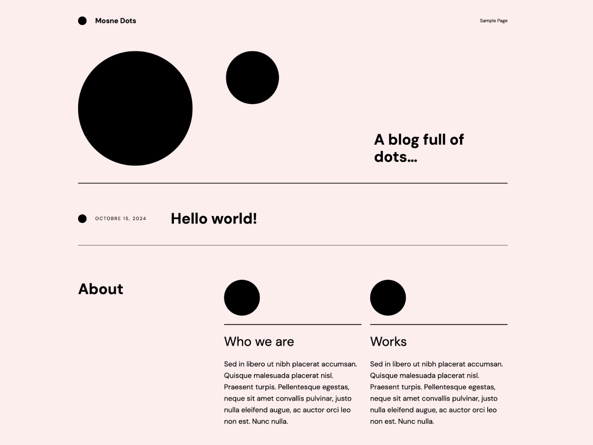

# Mosne Dots

**Contributors:** mosne  
**Requires at least:** 6.0  
**Tested up to:** 6.7-beta3  
**Requires PHP:** 5.7  
**License:** GPLv2 or later  
**License URI:** [http://www.gnu.org/licenses/gpl-2.0.html](http://www.gnu.org/licenses/gpl-2.0.html)   

## Description

**Block Theme:** minimal and typographical. It's light and fast with a nice cursor animation.  

**Demo site:**  
[https://dots.mosne.it/](https://dots.mosne.it/)  

**WordPress Theme directory:**  
coming soon  

**WordPress Playground:**  
[https://playground.wordpress.net](https://playground.wordpress.net/#{%22preferredVersions%22:{%22php%22:%227.4%22,%22wp%22:%22latest%22},%22steps%22:[{%22step%22:%22login%22,%22username%22:%22admin%22,%22password%22:%22password%22},{%22step%22:%22defineWpConfigConsts%22,%22consts%22:{%22WP_DEBUG%22:true}},{%22step%22:%22importFile%22,%22file%22:{%22resource%22:%22url%22,%22url%22:%22https:\/\/raw.githubusercontent.com\/WordPress\/theme-test-data\/master\/themeunittestdata.wordpress.xml%22,%22caption%22:%22Downloading%20theme%20testing%20content%22},%22progress%22:{%22caption%22:%22Installing%20theme%20testing%20content%22}},{%22step%22:%22installPlugin%22,%22pluginZipFile%22:{%22resource%22:%22wordpress.org\/plugins%22,%22slug%22:%22theme-check%22},%22options%22:{%22activate%22:true}},{%22step%22:%22installTheme%22,%22themeZipFile%22:{%22resource%22:%22url%22,%22url%22:%22https:\/\/downloads.wordpress.org\/theme\/mosne-dots.1.0.0.zip?nostats=1%22,%22caption%22:%22Downloading%20the%20theme%22}}]})

## Changelog

### 1.0.0
- Initial release

## Copyright

**Dots WordPress Theme, (C) 2024 mosne**  
Dots is distributed under the terms of the GNU GPL.

This program is free software: you can redistribute it and/or modify it under the terms of the GNU General Public License as published by the Free Software Foundation, either version 2 of the License, or (at your option) any later version.

This program is distributed in the hope that it will be useful, but WITHOUT ANY WARRANTY; without even the implied warranty of MERCHANTABILITY or FITNESS FOR A PARTICULAR PURPOSE. See the GNU General Public License for more details.

## Fonts

**DM Mono**  
Copyright 2020 The DM Mono Project Authors ([https://www.github.com/googlefonts/dm-mono](https://www.github.com/googlefonts/dm-mono))  
Source: [https://www.colophon-foundry.org](https://www.colophon-foundry.org)  
License: This Font Software is licensed under the SIL Open Font License, Version 1.1. This license is available with a FAQ at: [http://scripts.sil.org/OFL](http://scripts.sil.org/OFL)

**Noto Serif**  
Copyright 2022 The Noto Project Authors ([https://github.com/notofonts/latin-greek-cyrillic](https://github.com/notofonts/latin-greek-cyrillic))  
Source: [http://www.google.com/get/noto/](http://www.google.com/get/noto/)  
License: This Font Software is licensed under the SIL Open Font License, Version 1.1. This license is available with a FAQ at: [https://scripts.sil.org/OFL](https://scripts.sil.org/OFL)

**Jost**  
Copyright 2020 The Jost Project Authors ([https://github.com/indestructible-type/Jost](https://github.com/indestructible-type/Jost))  
License: This Font Software is licensed under the SIL Open Font License, Version 1.1. This license is available with a FAQ at: [http://scripts.sil.org/OFL](http://scripts.sil.org/OFL)

**DM Sans**  
Copyright 2014 The DM Sans Project Authors ([https://github.com/googlefonts/dm-fonts](https://github.com/googlefonts/dm-fonts))  
Source: [https://www.colophon-foundry.org](https://www.colophon-foundry.org)  
License: This Font Software is licensed under the SIL Open Font License, Version 1.1. This license is available with a FAQ at: [https://scripts.sil.org/OFL](https://scripts.sil.org/OFL)

## Recommended Plugins

**Mosne Dark Palette**  
[https://wordpress.org/plugins/mosne-dark-palette/](https://wordpress.org/plugins/mosne-dark-palette/)  
Easily add a dark mode to your site
